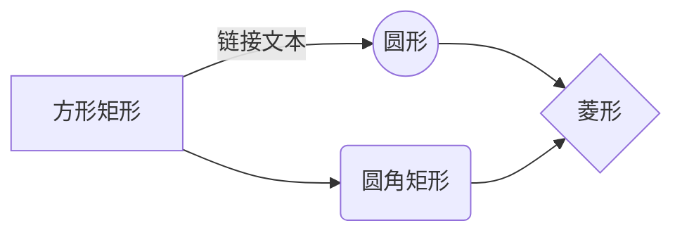

# Markdown 参考
通过勾选此选项自动生成目录：`设置 > 格式 > Markdown`。

## 二级标题
### 三级标题
#### 四级标题
##### 五级标题
###### 六级标题

<!-- --------------- -->

## 格式化文本

*斜体强调* ，_替代斜体强调_

**粗体强调** ，__替代粗体强调__

~~删除线~~

换行（行尾两个空格）  

> 块引用

`行内代码`

```
代码块
很棒
```

<!-- --------------- -->

## 列表
### 有序和无序

* 无序列表
* 使用星号
* 测试

- 另一个无序列表
- 使用连字符
- 测试

1. 有序列表
2. 测试
3. 测试
4. 测试

- 嵌套列表
    * 无序嵌套列表
    * 测试
    * 测试
    * 测试
- 有序嵌套列表
    1. 测试
    2. 测试
    3. 测试
    4. 测试
- 双重嵌套无序列表
    - 测试
    - 无序
        - 测试 a
        - 测试 b
    - 有序
        1. 测试 1
        2. 测试 2

### 清单
* [ ] 沙拉
* [x] 土豆

1. [x] 清洁
2. [ ] 烹饪

<!-- --------------- -->

## 链接
[链接](https://duckduckgo.com/)

[与文档位于同一文件夹的文件](markor-markdown-reference.md) 使用%20代替空格！

<!-- --------------- -->

## 表格

| 左对齐       | 居中对齐         | 右对齐         |
| :----------- | :--------------: | -------------: |
| 测试         | 测试             | 测试           |
| 测试         | 测试             | 测试           |

÷÷÷÷

短表格 | 语法   | 示例
:-----: | -----: | :-----
测试    | 测试   | 测试
测试    | 测试   | 测试

<!-- 注释：在视图中不可见。也可以跨多行。结束于：-->

<!-- ------------- -->

## 数学 (KaTeX)
参见[参考](https://katex.org/docs/supported.html)和[示例](https://github.com/waylonflinn/markdown-it-katex/blob/master/README.md)。在`设置 > Markdown`中勾选数学以启用。

### 行内数学

$ I = \frac V R $

### 数学块

$$\begin{array}{c} 
\nabla \times \vec{\mathbf{B}} -\, \frac{1}{c}\, \frac{\partial\vec{\mathbf{E}}}{\partial t} & = \frac{4\pi}{c}\vec{\mathbf{j}} \\
\nabla \cdot \vec{\mathbf{E}} & = 4 \pi \rho \\ 
\nabla \times \vec{\mathbf{E}}\, +\, \frac{1}{c}\, \frac{\partial\vec{\mathbf{B}}}{\partial t} & = \vec{\mathbf{0}} \\ 
\nabla \cdot \vec{\mathbf{B}} & = 0 \end{array}$$

$$\frac{k_t}{k_e} = \sqrt{2}$$

<!-- ------------- -->


## 格式化文本（续）

### 文字颜色

<span style='background-color:#ffcb2e;'>带背景色/高亮的文字</span>

<span style='color:#3333ff;'>文字前景色</span>

<span style='text-shadow: 0px 0px 2px #FF0000;'>带有彩色轮廓的文字</span> / <span style='text-shadow: 0px 0px 2px #0000FF; color: white'>带有彩色轮廓的文字</span>

### 文字上下标

<u>下划线</u>

这个<sub>地铁</sub>三明治<sup>超级</sup>

超级特殊字符：⁰ ¹ ² ³ ⁴ ⁵ ⁶ ⁷ ⁸ ⁹ ⁺ ⁻ ⁼ ⁽ ⁾ ⁿ ™ ® ℠

### 文字定位
<div markdown='1' align='right'>

右侧文字

</div>

<div markdown='1' align='center'>

居中文字  
（上方和下方各留一空行  
以支持Markdown或使用markdown='1'）

</div>

### 块文本

<div markdown='1' style='text-align: justify; text-justify: inter-word;'>
我的意思是说，如果你不同意我的观点，那就请你把你的想法告诉我，让我来告诉你我的想法，让我来告诉你我的想法。因此，我们对他们提出了指控，并对他们进行了公正的审判。
</div>

### 下拉菜单

<details markdown='1'><summary>点击展开/折叠</summary>

展开的内容。当点击展开时显示并保持可见。再次点击下拉按钮时再次隐藏。

</details>

### 分页
要分页（/开始新的一页），将以下div单独放在一行。
这对于从文档中创建可打印页面（打印/ PDF）很重要。

<div style='page-break-after: always'></div>

<!-- ------------- -->

## 多媒体

### 图片


### 视频
**Youtube** [欢迎来到上奥地利](https://www.youtube.com/watch?v=RJREFH7Lmm8)
<iframe width='360' height='200' src='https://www.youtube.com/embed/RJREFH7Lmm8'> </iframe>

**Peertube** [树林中的道路](https://open.tube/videos/watch/8116312a-dbbd-43a3-9260-9ea6367c72fc)
<div><video controls><source src='https://peertube.mastodon.host/download/videos/8116312a-dbbd-43a3-9260-9ea6367c72fc-480.mp4'></source></video></div>

<!-- **本地视频** <div><video controls><source src='voice-parrot.mp4'></source></video></div> -->

### 音频和音乐
**网络音频** [Guifrog - Xia Yu](https://www.freemusicarchive.org/music/Guifrog/Xia_Yu)
<audio controls src='https://files.freemusicarchive.org/storage-freemusicarchive-org/music/ccCommunity/Guifrog/Xia_Yu/Guifrog_-_Xia_Yu.mp3'></audio>

**本地音频** Yellowcard - Lights up in the sky
<audio controls src='../Music/mp3/Yellowcard/[2007]%20Paper%20Walls/Yellowcard%20-%2005%20-%20Light%20Up%20the%20Sky.mp3'></audio>


## 图表 / 图形 / 图示 (mermaidjs)
饼图、流程图、序列图、类图、状态图、ER图  
另见：mermaidjs [在线编辑器](https://mermaid-js.github.io/mermaid-live-editor/)。



## 警示扩展
创建块样式的侧栏内容。  
使用以下限定词之一来选择图标和块颜色：

| 英文单词    | 中文翻译     | 英文单词    | 中文翻译     |
| ---------- | ------------ | ---------- | ------------ |
| abstract   | 摘要         | snippet    | 片段         |
| summary    | 总结         | failure    | 失败         |
| tldr       | 简而言之       | fail       | 失败         |
| bug        | 错误         | missing    | 缺失         |
| danger     | 危险         | question   | 问题         |
| error      | 错误         | help       | 帮助         |
| example    | 示例         | faq        | 常见问题解答   |
| quote      | 引用         | cite       | 引用         |
| info       | 信息         | success    | 成功         |
| todo       | 待办         | check      | 检查         |
| note       | 注意         | done       | 已完成        |
| seealso    | 另请参阅       | tip        | 提示         |
| important  | 重要         | hint       | 提示         |
| warning    | 警告         | caution    | 注意         |
| attention  | 注意         |             |              |


!!! warning '可选标题'
    带有**Markdown支持**的块样式侧栏内容

!!! info ''
    我们的研究（学习）目标应当是引导心灵（思想），以便对所遇到的一切形成真实且正确的判断。

??? bug '默认收起'
    可折叠的块样式侧栏内容

???+ example '默认展开'
    可折叠的块样式侧栏内容

------------------

此Markdown参考文件是为[Markor](https://github.com/gsantner/markor)项目由[Gregor Santner](https://github.com/gsanter)创建，并采用[Creative Commons Zero 1.0](https://creativecommons.org/publicdomain/zero/1.0/legalcode)（公共领域）许可。文件修订版3。

------------------
